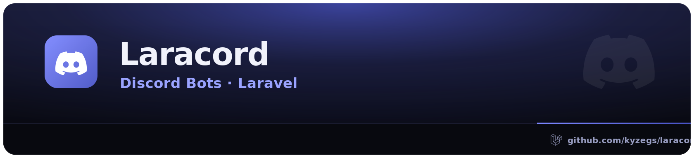

# Laracord

Laravel-native Discord HTTP platform client for PHP 8.2+ and Laravel 12–13.

```php
use Kyzegs\Laracord\Facades\Laracord;

$message = Laracord::bot()->messages()->create(
    ['channel_id' => '123456789012345678'],
    ['content' => 'Hello from Laracord'],
);

echo $message->json('id');
```

Laracord provides bot and OAuth bearer contexts, Discord-aware cross-process rate limiting, every catalogued HTTP route, multipart uploads, Socialite, webhook notifications, and signed interaction/webhook-event helpers.

```bash
composer require kyzegs/laracord:^1.0@rc
php artisan vendor:publish --tag=laracord-config
```

See [`docs/docs/getting-started.md`](docs/docs/getting-started.md) and [`docs/docs/usage/migration-v1.md`](docs/docs/usage/migration-v1.md).

Gateway, voice transport, RPC, Embedded App SDK, and Social SDK clients are intentionally outside scope.

MIT licensed.
